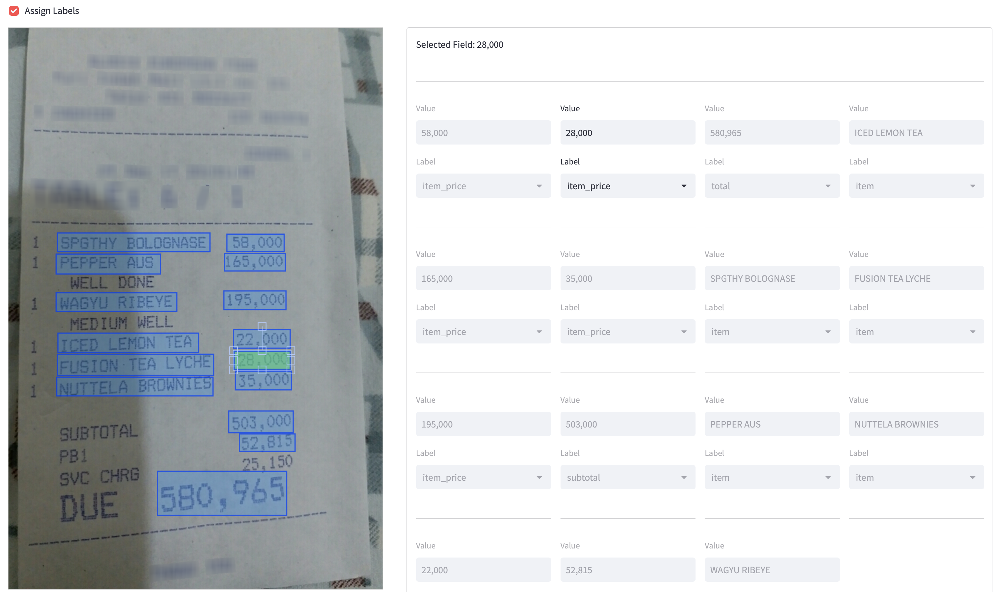

# Streamlit - Labeling Component

Streamlit component which provides labeling functionality for documents and invoices. Based on [streamlit-drawable-canvas](https://github.com/andfanilo/streamlit-drawable-canvas).



## Features

- Option to switch between rectangle selection/resize and new rectangle creation
- Returning info about currently selected rectangle, this allows to provide label for this rectangle
- Labeling data is stored in simple/readable JSON format. This data is auto converted to Fabric.js format by the component
- Canvas resizing and rectangle data resizing. Coordinates are saved in original dimension

## Installation

```shell script
pip install streamlit-sparrow-labeling
```

## Example Usage

Copy this code snippet:

```python
from PIL import Image
import streamlit as st
import streamlit_nested_layout
import streamlit_javascript as st_js
from streamlit_sparrow_labeling import st_sparrow_labeling
from streamlit_sparrow_labeling import DataProcessor
import json
import math

st.set_page_config(
    page_title="Sparrow Labeling",
    layout="wide"
)

def run(img_file, rects_file, labels):
    ui_width = st_js.st_javascript("window.innerWidth")

    docImg = Image.open(img_file)

    if 'saved_state' not in st.session_state:
        with open(rects_file, "r") as f:
            saved_state = json.load(f)
            st.session_state['saved_state'] = saved_state
    else:
        saved_state = st.session_state['saved_state']

    assign_labels = st.checkbox("Assign Labels", True)
    mode = "transform" if assign_labels else "rect"

    data_processor = DataProcessor()

    col1, col2 = st.columns([4, 6])

    with col1:
        height = 1296
        width = 864

        doc_height = saved_state['meta']['image_size']['height']
        doc_width = saved_state['meta']['image_size']['width']

        canvas_width = canvas_available_width(ui_width)

        result_rects = st_sparrow_labeling(
            fill_color="rgba(0, 151, 255, 0.3)",
            stroke_width=2,
            stroke_color="rgba(0, 50, 255, 0.7)",
            background_image=docImg,
            initial_rects=saved_state,
            height=height,
            width=width,
            drawing_mode=mode,
            display_toolbar=True,
            update_streamlit=True,
            canvas_width=canvas_width,
            doc_height=doc_height,
            doc_width=doc_width,
            image_rescale=True,
            key="doc_annotation"
        )

        st.caption("Check 'Assign Labels' to enable editing of labels and values, move and resize the boxes to "
                   "annotate the document.")
        st.caption("Add annotations by clicking and dragging on the document, when 'Assign Labels' is unchecked.")

    with col2:
        if result_rects is not None:
            with st.form(key="fields_form"):
                if result_rects.current_rect_index is not None and result_rects.current_rect_index != -1:
                    st.write("Selected Field: ",
                             result_rects.rects_data['words'][result_rects.current_rect_index]['value'])
                    st.markdown("---")

                if ui_width > 1500:
                    render_form_wide(result_rects.rects_data['words'], labels, result_rects, data_processor)
                elif ui_width > 1000:
                    render_form_avg(result_rects.rects_data['words'], labels, result_rects, data_processor)
                elif ui_width > 500:
                    render_form_narrow(result_rects.rects_data['words'], labels, result_rects, data_processor)
                else:
                    render_form_mobile(result_rects.rects_data['words'], labels, result_rects, data_processor)

                submit = st.form_submit_button("Save", type="primary")
                if submit:
                    with open(rects_file, "w") as f:
                        json.dump(result_rects.rects_data, f, indent=2)
                    with open(rects_file, "r") as f:
                        saved_state = json.load(f)
                        st.session_state['saved_state'] = saved_state
                    st.write("Saved!")


def render_form_wide(words, labels, result_rects, data_processor):
    col1_form, col2_form, col3_form, col4_form = st.columns([1, 1, 1, 1])
    num_rows = math.ceil(len(words) / 4)

    for i, rect in enumerate(words):
        if i < num_rows:
            with col1_form:
                render_form_element(rect, labels, i, result_rects, data_processor)
        elif i < num_rows * 2:
            with col2_form:
                render_form_element(rect, labels, i, result_rects, data_processor)
        elif i < num_rows * 3:
            with col3_form:
                render_form_element(rect, labels, i, result_rects, data_processor)
        else:
            with col4_form:
                render_form_element(rect, labels, i, result_rects, data_processor)


def render_form_avg(words, labels, result_rects, data_processor):
    col1_form, col2_form, col3_form = st.columns([1, 1, 1])
    num_rows = math.ceil(len(words) / 3)

    for i, rect in enumerate(words):
        if i < num_rows:
            with col1_form:
                render_form_element(rect, labels, i, result_rects, data_processor)
        elif i < num_rows * 2:
            with col2_form:
                render_form_element(rect, labels, i, result_rects, data_processor)
        else:
            with col3_form:
                render_form_element(rect, labels, i, result_rects, data_processor)


def render_form_narrow(words, labels, result_rects, data_processor):
    col1_form, col2_form = st.columns([1, 1])
    num_rows = math.ceil(len(words) / 2)

    for i, rect in enumerate(words):
        if i < num_rows:
            with col1_form:
                render_form_element(rect, labels, i, result_rects, data_processor)
        else:
            with col2_form:
                render_form_element(rect, labels, i, result_rects, data_processor)


def render_form_mobile(words, labels, result_rects, data_processor):
    for i, rect in enumerate(words):
        render_form_element(rect, labels, i, result_rects, data_processor)


def render_form_element(rect, labels, i, result_rects, data_processor):
    default_index = 0
    if rect['label']:
        default_index = labels.index(rect['label'])

    value = st.text_input("Value", rect['value'], key=f"field_value_{i}",
                          disabled=False if i == result_rects.current_rect_index else True)
    label = st.selectbox("Label", labels, key=f"label_{i}", index=default_index,
                         disabled=False if i == result_rects.current_rect_index else True)
    st.markdown("---")

    data_processor.update_rect_data(result_rects.rects_data, i, value, label)


def canvas_available_width(ui_width):
    # Get ~40% of the available width, if the UI is wider than 500px
    if ui_width > 500:
        return math.floor(38 * ui_width / 100)
    else:
        return ui_width


if __name__ == "__main__":
    custom_labels = ["", "item", "item_price", "subtotal", "tax", "total"]
    run("docs/image/receipt_00001.png", "docs/json/receipt_00001.json", custom_labels)
```

## API

```
result_rects = st_sparrow_labeling(
    fill_color="rgba(0, 151, 255, 0.3)",
    stroke_width=2,
    stroke_color="rgba(0, 50, 255, 0.7)",
    background_image=docImg,
    initial_rects=saved_state,
    height=height,
    width=width,
    drawing_mode=mode,
    display_toolbar=True,
    update_streamlit=True,
    canvas_width=canvas_width,
    doc_height=doc_height,
    doc_width=doc_width,
    image_rescale=True,
    key="doc_annotation"
)
```

- **fill_color** : Color of fill for Rect in CSS color property. Defaults to "#eee".
- **stroke_width** : Width of drawing brush in CSS color property. Defaults to 20.
- **stroke_color** : Color of drawing brush in hex. Defaults to "black".
- **background_image** : Pillow Image to display behind canvas. Automatically resized to canvas dimensions. Being behind the canvas, it is not sent back to Streamlit on mouse event. Overrides background_color. Changes to this will reset canvas contents.
- **initial_rects** : Initial Rects to display on canvas. Defaults to empty list.
- **update_streamlit** : Whenever True, send canvas data to Streamlit when object/selection is updated or mouse up.
- **height** : Height of canvas in pixels. Defaults to 400.
- **width** : Width of canvas in pixels. Defaults to 600.
- **drawing_mode** : Enable free drawing when "freedraw", object manipulation when "transform", otherwise create new objects with "line", "rect", "circle" and "polygon". Defaults to "freedraw".
  - On "polygon" mode, double-clicking will remove the latest point and right-clicking will close the polygon.
- **initial_drawing** : Initialize canvas with drawings from here. Should be the `json_data` output from other canvas. Beware: if you try to import a drawing from a bigger/smaller canvas, no rescaling is done in the canvas and the import could fail.
- **display_toolbar** : If `False`, don't display the undo/redo/delete toolbar.
- **canvas_width** : Width of the canvas in pixels.
- **doc_height** : Original height of the document in pixels.
- **doc_width** : Original width of the document in pixels.
- **image_rescale** : If `True`, rescale the image to fit the canvas. Defaults to `False`.

## Development

### Install

- JS side

```shell script
cd frontend
npm install
```

- Python side

```shell script
conda create -n streamlit-sparrow-labeling python=3.11
conda activate streamlit-sparrow-labeling
pip install -e .
```

### Run

Both webpack dev server and Streamlit should run at the same time.

- JS side

```shell script
cd frontend
npm run start
```

- Python side

```shell script
streamlit run app.py
```